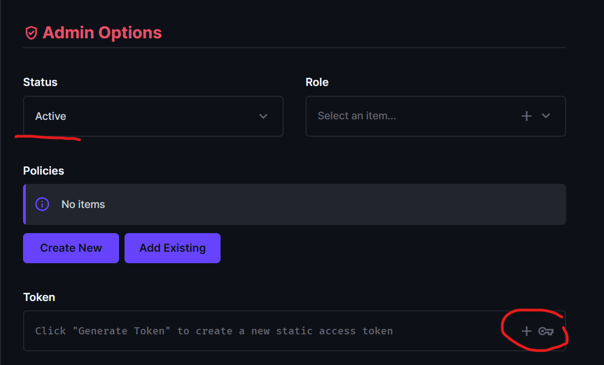

# Directus Integration

## Configuration (`src/index.ts`)

This is the central file for defining your Directus integration. Everything starts here.

### DIRECTUS_URL

Set via `DIRECTUS_URL` environment variable (`.env` file or CI/CD). Defaults to `http://localhost:8055`.

### Token Names

The token cookie names can be customized:

```typescript
export const DIRECTUS_SESSION_TOKEN = 'directus_session_token';
export const DIRECTUS_REFRESH_TOKEN = 'directus_refresh_token';
export const DIRECTUS_TOKEN_EXPIRES_AT = 'directus_token_expires_at';
```

### Defining Collections

All collections are defined as `CollectionDefinition` objects with their fields and types:

```typescript
export const songDefinition: CollectionDefinition = {
  id: {
    field: 'id',
    type: 'integer',
    schema: { is_primary_key: true, has_auto_increment: true },
    meta: { readonly: true },
  },
  name: {
    field: 'name',
    type: 'string',
    meta: { required: true },
  },
};
```

Each collection must be:

1. Added to `schemaDefinition`:

   ```typescript
   export const schemaDefinition: SchemaDefinition = {
     songs: songDefinition,
     private: songDefinition,
   };
   ```

2. Exported as a type using `FromDefinition`:
   ```typescript
   export type Song = FromDefinition<typeof songDefinition>;
   ```

This enables type-safe access in `packages/app` when importing from `@t3ds/directus`.

### Usage in App

```typescript
import { type Song } from '@t3ds/directus';
```

## Migration / Initialize

### Setup Migration

1. Go to your Directus admin panel and create a tech-user
2. Make sure `status` is set to active and generate a token (see `docs/admin-options.png` for reference)
3. Save the user and add the token to `.env` at the project root as `DIRECTUS_STATIC_TOKEN`



### Running Migration

Running the migration script creates all collections and fields defined in `schemaDefinition` in your Directus database:

```bash
pnpm --filter @t3ds/directus init
```

This executes `scripts/migrate.ts`, which compares the schema definition against the existing database and creates any missing collections or fields.
