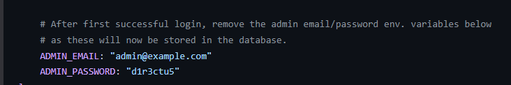

# Deploying on Dokploy

This guide walks you through deploying the project on Dokploy using the automated init script.

## Prerequisites

- [Dokploy](https://docs.dokploy.com/docs/core) instance running and accessible
- DNS records pointing to your Dokploy server for both app and Directus domains
- A Dokploy API key (generate one in Dokploy under Settings > API Keys)
- A Docker image registry for the app (e.g. GitHub Container Registry)
- A published Docker image of the app

## Setup

### 1. Configure Environment

Copy `.env.local` at the project root and fill in the values:

```bash
# Directus
DIRECTUS_URL=https://directus.your-domain.com

# Dokploy
DOKPLOY_API_KEY=your-api-key
DOKPLOY_API_URL=https://dokploy.your-domain.com/api

# App
APP_URL=https://your-domain.com
APP_TAG=latest
APP_IMAGE=ghcr.io/your-org/your-app
```

| Variable          | Description                                                        |
| ----------------- | ------------------------------------------------------------------ |
| `DIRECTUS_URL`    | Public URL of your Directus instance                               |
| `DOKPLOY_API_KEY` | API key from Dokploy (Settings > API Keys)                         |
| `DOKPLOY_API_URL` | Dokploy API base URL                                               |
| `APP_URL`         | Public URL of the frontend app (also used as Directus CORS origin) |
| `APP_TAG`         | Docker image tag to deploy                                         |
| `APP_IMAGE`       | Docker image name (without tag)                                    |

### 2. Run the Init Script

```bash
pnpm install
pnpm --filter @t3ds/dokploy init
```

This will automatically:

1. Create a Dokploy project named after the root `package.json` name
2. Create a **Directus** compose service with:
   - PostgreSQL database, Redis cache, and Directus
   - Auto-generated `DATABASE_PASSWORD` and `DIRECTUS_SECRET` (base64)
   - Default admin credentials (`admin@example.com` / `d1r3ctu5`)
   - HTTPS domain with Let's Encrypt on port 8055
3. Create an **App** compose service with:
   - The SSR app from your Docker image
   - Traefik compress middleware
   - HTTPS domain with Let's Encrypt on port 3000

### 3. Deploy

After the init script completes, go to the Dokploy dashboard and deploy both compose services.

### 4. Secure Admin Access

**Important:** Change the default Directus admin credentials immediately after first deployment.

1. Log in to Directus at your `DIRECTUS_URL`
2. Navigate to User Settings
3. Change the admin password to a strong, unique password
4. Remove the default password from the compose environment variables in Dokploy



### 5. Initialize dirctus

Follow the instructions of [packages/directus/README.md](../directus/README.md#migration--initialize), with the credentials of your deployed Directus instance.

## Troubleshooting

**CORS errors:** Verify `APP_URL` matches the exact origin of your frontend (including protocol).

**Connection issues:** Ensure all services are on the `dokploy-network` and can communicate.

**Login problems:** Check logs in the Dokploy dashboard for authentication errors.

**Init script fails:** Verify your `DOKPLOY_API_KEY` is valid and `DOKPLOY_API_URL` is correct.

## Additional Resources

- [Directus Documentation](https://docs.directus.io/)
- [Dokploy Documentation](https://docs.dokploy.com/docs/core)
